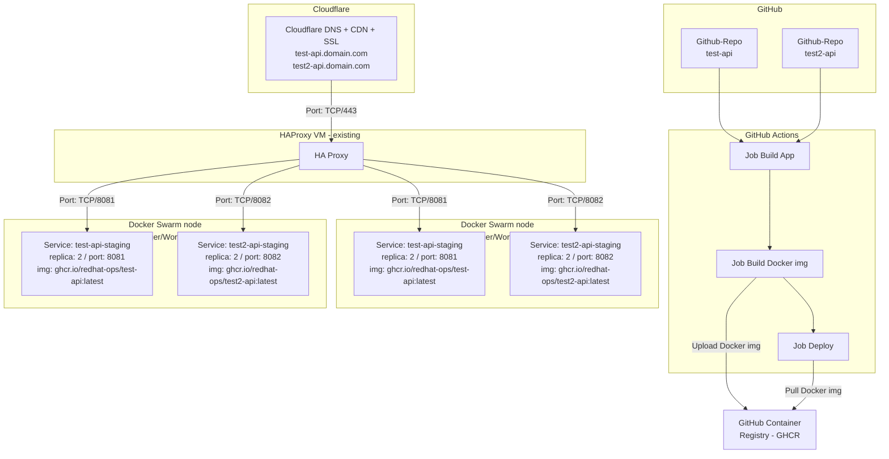

# Lab 01 — CI/CD Pipeline with Docker Swarm

Deploy [test-api](https://github.com/redhat-ops/test-api) to a Docker Swarm cluster using GitHub Actions. Expose via HAProxy + Cloudflare.

---

## Prerequisites

- GitHub account with access to [redhat-ops](https://github.com/redhat-ops)
- 2 Linux VMs for Docker Swarm (Ubuntu 22.04+ or RHEL 9+)
- 1 existing HAProxy VM
- Container registry account (Docker Hub or GHCR)
- Cloudflare account with a managed domain
- Ansible installed on your workstation

---

## Tasks

### Task 1 — Provision 2 VMs for Docker Swarm

1. Create 2 Linux VMs (swarm-manager, swarm-worker)
2. Assign static IPs
3. Open ports: `2377/tcp`, `7946/tcp+udp`, `4789/udp`, `8081/tcp`, `8082/tcp`
4. Configure SSH key access from your workstation

### Task 2 — Setup VMs with Ansible

1. Create Ansible project structure (see [reference](#ansible-project-structure) below)
2. Define inventory with swarm-manager and swarm-worker hosts
3. Write a playbook that:
   - Installs Docker Engine on both VMs
   - Initializes Swarm on the manager
   - Joins the worker to the cluster
4. Run the playbook
5. Verify both nodes show `Ready`

### Task 3 — Write Dockerfile

1. Create a multi-stage `Dockerfile` in the test-api repo
2. Build stage: .NET SDK, restore, publish
3. Runtime stage: ASP.NET runtime, expose port, copy wordlist

### Task 4 — GitHub Actions: Build & Test

1. Create `.github/workflows/deploy.yml`
2. Trigger on push to `main`
3. Checkout code
4. Setup .NET SDK
5. Run `dotnet restore`
6. Run `dotnet build`
7. Run `dotnet test`

### Task 5 — GitHub Actions: Build & Push Docker Image

1. Build Docker image
2. Tag with commit SHA and `latest`
3. Login to GHCR (GitHub Container Registry)
4. Push image to `ghcr.io/redhat-ops/<app>:latest`
5. Store registry credentials as GitHub secrets

### Task 6 — GitHub Actions: Deploy to Swarm

1. SSH into swarm-manager from GitHub Actions
2. Pull the new image from GHCR
3. Create or update the Swarm service with 2 replicas
4. Publish on port 8081 (test-api) / 8082 (test2-api)
5. Store SSH credentials as GitHub secrets

### Task 7 — Configure HAProxy (existing VM)

1. Add Swarm VMs as backend targets on ports 8081 and 8082
2. Configure frontend to listen on ports 80 and 443
3. Map `test-api.domain.com` to port 8081, `test2-api.domain.com` to port 8082
4. Enable health checks
5. Reload HAProxy

### Task 8 — Expose via Cloudflare

1. Add DNS A records for `test-api.domain.com` and `test2-api.domain.com` pointing to HAProxy VM public IP (proxied)
2. Set SSL/TLS mode to Full
3. Generate and install Cloudflare Origin Certificate on HAProxy VM
4. Configure HAProxy TLS termination with the origin cert
5. Verify both APIs are accessible over HTTPS

---

## Ansible Project Structure

```
ansible/
├── inventory/
│   └── hosts.yml
├── roles/
│   ├── docker/
│   │   └── tasks/
│   │       └── main.yml
│   └── swarm/
│       └── tasks/
│           └── main.yml
└── playbook.yml
```

**inventory/hosts.yml**
```yaml
all:
  children:
    swarm_managers:
      hosts:
        swarm-manager:
          ansible_host: 192.168.1.10
    swarm_workers:
      hosts:
        swarm-worker:
          ansible_host: 192.168.1.11
```

**roles/docker/tasks/main.yml**
```yaml
- name: Install Docker dependencies
  apt:
    name: [ca-certificates, curl, gnupg]
    state: present

- name: Add Docker GPG key and repository
  # ...

- name: Install Docker Engine
  apt:
    name: [docker-ce, docker-ce-cli, containerd.io]
    state: present

- name: Start and enable Docker
  systemd:
    name: docker
    state: started
    enabled: true
```

**roles/swarm/tasks/main.yml**
```yaml
- name: Initialize Docker Swarm
  command: docker swarm init --advertise-addr {{ ansible_host }}
  when: inventory_hostname in groups['swarm_managers']
  register: swarm_init

- name: Get join token
  command: docker swarm join-token -q worker
  when: inventory_hostname in groups['swarm_managers']
  register: worker_token

- name: Join worker to Swarm
  command: >
    docker swarm join
    --token {{ hostvars[groups['swarm_managers'][0]].worker_token.stdout }}
    {{ hostvars[groups['swarm_managers'][0]].ansible_host }}:2377
  when: inventory_hostname in groups['swarm_workers']
```

**playbook.yml**
```yaml
- name: Setup Docker Swarm Cluster
  hosts: all
  become: true
  roles:
    - docker
    - swarm
```

**Run:**
```bash
ansible-playbook -i inventory/hosts.yml playbook.yml
```

---

## Deliverables

- [ ] 2 Swarm VMs provisioned via Ansible
- [ ] Docker Swarm cluster with 2 nodes
- [ ] Dockerfile for test-api
- [ ] GitHub Actions workflow: build/test → docker push → deploy
- [ ] test-api running on Swarm with 2 replicas
- [ ] HAProxy routing traffic to Swarm nodes
- [ ] API accessible via Cloudflare HTTPS

---

## Architecture


